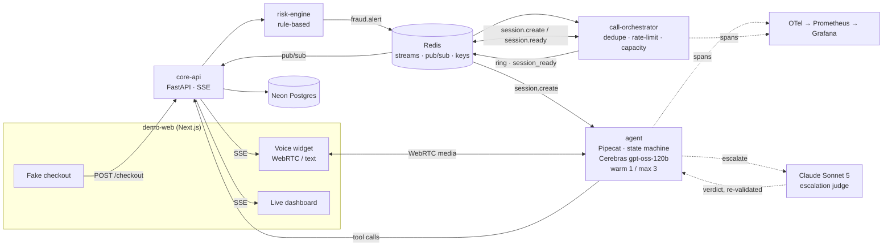
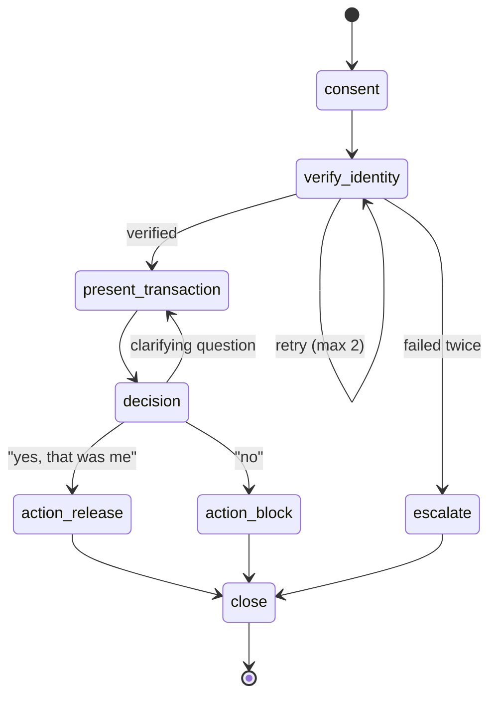

# Sentinel — Voice AI Fraud Detection

**An event-driven voice agent that calls a cardholder within seconds of a suspicious transaction, verifies their identity, and releases or blocks the card — replacing the "press 1 if this was you" IVR with a real conversation.**

<p>
  
  
  
  
  
</p>

> **Status — design complete, implementation in progress.**
> The architecture, event contracts, state machine, failure map, and phased build plan are fully specified in [`docs/`](docs/). Code lands against [`docs/PLAN.md`](docs/PLAN.md), which gates every phase on a checkable *done when*. **If you are evaluating this repo today, the design docs are the artifact** — start with [BRIEF.md](docs/BRIEF.md).

---

## Why this problem is interesting

Card issuers run outbound fraud-verification calls at enormous scale. Swapping the IVR tree for an LLM is the easy part. The engineering is everywhere else:

- **Latency is a product requirement, not a metric.** A fraud callback that arrives 30 seconds late is worthless, and a voice agent that pauses two seconds mid-sentence is unusable. Two independent budgets — alert-to-ring and voice-to-voice — must hold *simultaneously*, under load.
- **The agent has irreversible powers.** It can block a live card or release a held transaction. An LLM that can be talked into `release_hold` is itself a fraud vector, so authority lives in a state machine, never in a prompt.
- **500 alerts can fire at once.** Idempotency, dedupe, rate limiting, capacity backpressure, and graceful degradation are the actual work.

Sentinel builds that slice of an enterprise fraud-ops system end to end, with a public browser sandbox anyone can try.

---

## Architecture



**The flow:** a visitor clicks *Pay $940 at "Lisboa Eletrónica"* → the risk engine flags it (foreign merchant and amount over threshold) and emits `fraud.alert` → the orchestrator dedupes, rate-limits, checks agent capacity, and rings the browser → the agent verifies identity, reads back the transaction, and acts on the answer → the dashboard shows the outcome, the audit trail, and per-turn latency.

Full sequence including every failure branch: [`docs/02_handshake.mermaid`](docs/02_handshake.mermaid).

---

## Engineering decisions

Each of these had a cheaper option, rejected for a specific reason. Full decision log with alternatives in [BRIEF §5](docs/BRIEF.md).

| Decision | Choice | Why not the obvious alternative |
|---|---|---|
| How the browser learns it is being called | Persistent **SSE** from page load; orchestrator pushes `ring` | Polling adds up to a full interval to p95; a blocking checkout POST collapses the event pipeline into an RPC that can never ring later or extend to phone |
| Signaling vs. media | **SSE for signaling, separate WebRTC for media** | One WebSocket for both means an SSE reconnect drops the live call |
| Orchestrator to agent | **Redis streams both directions**, never blocks | HTTP request/response idles the orchestrator through pre-warm — 50 alerts become 50 blocked waits |
| Connection registry | **Redis from day one** | An in-process dict breaks the moment `core-api` runs two instances |
| Agent authority | **State machine in code**; the LLM only *proposes* transitions | Prompt-level rules are negotiable; a validator is not |
| Speed vs. correctness | **Two model tiers** — fast in-band, strong judge on escalation | A single model permanently trades turn latency against tool discipline |
| Backpressure | Warm pool 1, **max 3 concurrent**, atomic `DECR`-and-check | Unbounded concurrency is a cost-exhaustion vector; a 1/1 pool bounces the second visitor |

---

## Safety invariants

Enforced in code and tested in CI — these are the project's success criteria, not aspirations:

| Invariant | Mechanism |
|---|---|
| The agent **cannot** act without verifying identity | `action_release` / `action_block` are unreachable unless `verify_identity` passed; every tool is state-guarded |
| A card number is **never** spoken or logged | Regex + Luhn redaction on every transcript and log line before persistence |
| Nobody can **join someone else's call** | Single-use WebRTC token bound to `call_id`, expiring with the 30 s ring timeout |
| A stronger model **cannot** override the rules | Judge verdicts are re-validated by the same state machine — it proposes, it never authorises |
| An unreachable judge **cannot** become an approval | Judge timeout or rate-limit fails closed to `escalate_to_analyst` |

### Conversation state machine



The LLM emits a structured `{reply_text, proposed_state, tool_call?}`. The validator accepts or rejects it. A rejection escalates to the judge — bounded at one escalation per turn — and the judge's answer passes through the *same* validator. See [`docs/03b_transition_guard_loop.mermaid`](docs/03b_transition_guard_loop.mermaid).

---

## Model stack

Split by what each tier is actually good at:

| Role | Model | When it runs | Why |
|---|---|---|---|
| Turn loop | **Cerebras `gpt-oss-120b`** | Every caller turn, in-band | Keeps `llm_ms` inside the sub-1.2 s p50 voice-to-voice budget |
| Judge / verifier | **Claude Sonnet 5** | Validator rejection, or any irreversible action | Stronger tool and instruction discipline where a wrong call cannot be undone |

Escalation is rare by construction, so the strong model costs pennies. The real budget is latency, which is why the triggers are narrow.

---

## What gets measured

One OpenTelemetry trace per call, `trace_id = call_id`, spanning `ring` → `session.create`/`session.ready` → `webrtc.connect` → per-turn `stt` / `llm` / `tool.*` / `tts` / `network`.

| Target | SLO |
|---|---|
| Alert → browser ring | **< 3 s p95** |
| Voice → voice turn latency | **< 1.2 s p50 · < 2 s p95** |
| `action_*` without prior verification | **zero** (tested) |
| Unredacted card-number strings in logs | **zero** (tested) |

Also tracked: verification success rate, decision distribution, `agent_sessions_active` / `agent_sessions_rejected`, `session_create_stream_lag` (the backpressure signal), warm-pool hit rate, dedupe hits, rate-limit rejections, SSE reconnects, and judge invocations by trigger and verdict.

**Load test:** 10 → 20 → 50 concurrent simulated callers with scripted audio, run to find the breaking point rather than to claim there isn't one. Current hypothesis: `session.create` stream lag once `agent:capacity` hits zero. Findings and the mitigation plan land in `docs/SCALING.md`.

---

## Stack

| Layer | Choice |
|---|---|
| Voice pipeline | Pipecat · WebRTC (SmallWebRTC) · Twilio μ-law (v1.1) |
| Speech | Deepgram Nova (STT) · Cartesia (TTS) |
| Reasoning | Cerebras `gpt-oss-120b` · Claude Sonnet 5 (judge) |
| Services | FastAPI — `risk-engine`, `call-orchestrator`, `agent`, `core-api` |
| Event bus | Redis — Streams, pub/sub, and keys, in three deliberately separate roles |
| Data | Neon Postgres, branch per environment |
| Frontend | Next.js — fake checkout, voice widget, live dashboard |
| Observability | OpenTelemetry · Prometheus · Grafana |

Redis is used three ways on purpose: **streams** are durable consumer-group queues where an unacked entry is redelivered after a crash; **pub/sub** is fire-and-forget fan-out where a dropped message is the *correct* outcome for a ring nobody is listening for; **keys** hold dedupe locks, the connection registry, and the capacity counter.

---

## Repo map

```
docs/
  BRIEF.md                          problem, scenario, architecture, decisions, open questions
  PLAN.md                           phased build plan — entry gates, priorities, done-when
  01_architecture_overview.mermaid  service topology
  02_handshake.mermaid              alert → ring → answer sequence, with failure branches
  03_state_machine.mermaid          conversation pathway with tool guards
  03b_transition_guard_loop.mermaid LLM proposal → validator → judge → commit
  05_failure_recovery_map.mermaid   every known failure and its recovery
services/
  demo-web/                         checkout, voice widget, dashboard (Next.js)
  risk-engine/                      rule evaluation → fraud.alert (FastAPI)
  call-orchestrator/                dedupe, rate limit, capacity, ring timer (FastAPI worker)
  agent/                            Pipecat pipeline, state machine, tools, judge
  core-api/                         Postgres, tools, checkout, SSE endpoint (FastAPI)
neon.ts                             Neon config policy
```

Each service directory carries a README stating what it owns, what it deliberately does not,
and which streams, pub/sub channels, and Redis keys it touches.

---

## Roadmap

| Phase | Deliverable |
|---|---|
| 0 · Bootstrap | Monorepo, schema on Neon, shared event contracts, health/metrics scaffold |
| 1 · Transport | Browser mic → Pipecat → speaker, per-frame timing |
| 2 · Conversation | STT + LLM + TTS, persona, five tools, card-number redaction, happy path |
| 3 · Event pipeline | State machine, risk engine, orchestrator, SSE handshake, capacity, judge escalation |
| 4 · Demo + observability | Fake checkout, live dashboard, OTel traces, metrics, deploy |
| 5 · Hardening | The invariant tests above, in CI |
| v1.1 | Twilio "call me" with SMS OTP, load test, `SCALING.md`, `THREAT_MODEL.md` |
| v2 | Self-hosted speech (Whisper/Parakeet + Kokoro), WER and latency benchmarks vs. vendors |

---

## Notes

Sentinel is a systems-design showcase, not a production fraud system. The risk engine is rule-based and deliberately fake, and PCI-DSS / TCPA compliance is documented as a threat model rather than implemented — both are stated non-goals in [BRIEF §3](docs/BRIEF.md). "Meridian Bank" is the fictional issuer the agent represents on a call.
