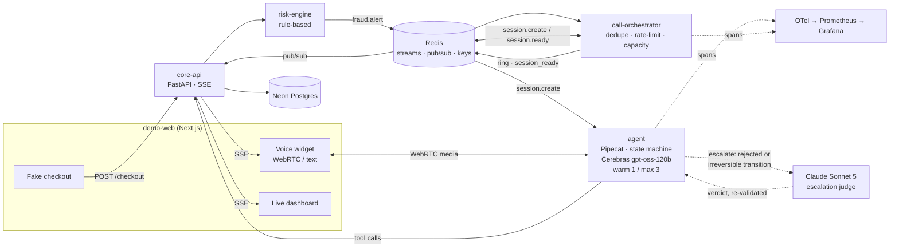
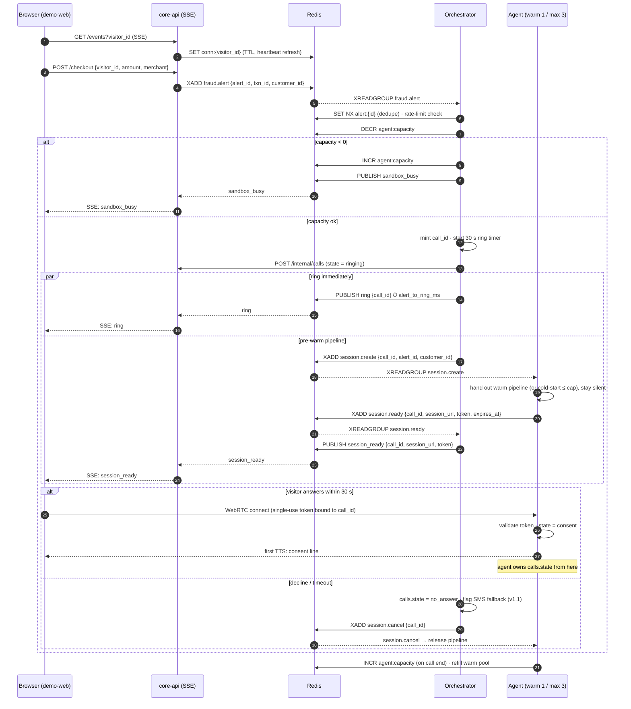
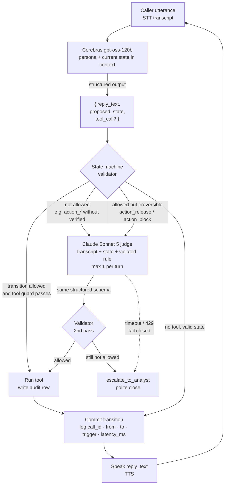
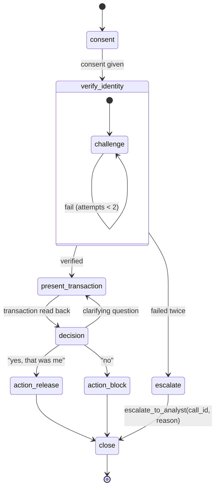
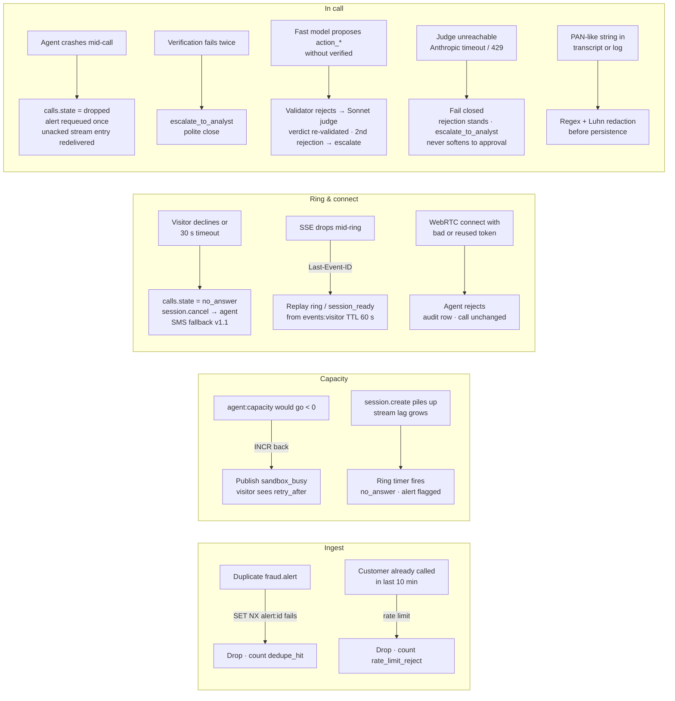

# ARCHITECTURE — Sentinel

How the system is put together: the services, the boundaries between them, the events that cross those boundaries, and the invariants each boundary exists to protect.

This is the *how*. The *why* — problem framing, scenario, and the decision log with rejected alternatives — is in [BRIEF.md](BRIEF.md). The *when* is in [PLAN.md](PLAN.md).

| Document | Answers |
|---|---|
| [BRIEF.md](BRIEF.md) | Why this problem, what the demo does, which alternatives were rejected and on what grounds |
| **ARCHITECTURE.md** | How the pieces fit, who owns what, what crosses each boundary |
| [PLAN.md](PLAN.md) | Build order, entry gates, checkable *done when* per task |
| `services/*/README.md` | Per-service contract: responsibilities, interfaces, non-responsibilities |
| `docs/*.mermaid` | Diagram sources — **these are canonical**; the copies embedded below track them |

---

## 1. Topology



Source: [`01_architecture_overview.mermaid`](01_architecture_overview.mermaid).

| Service | Process model | Holds live state? | Scales by | External dependencies |
|---|---|---|---|---|
| `demo-web` | Next.js app, stateless | No — `visitor_id` cookie only | CDN / instances | none (talks only to `core-api`, and to `agent` for media) |
| `core-api` | FastAPI, long-lived SSE connections | Yes — one open SSE per visitor, registered in Redis so *any* instance can be found | instances (the Redis registry makes this safe) | Neon, Redis |
| `risk-engine` | FastAPI, request/response | No | instances | Redis (producer only) |
| `call-orchestrator` | FastAPI worker, consumer group + in-process ring timers | Yes — a 30 s timer per ringing call | consumer-group members | Redis, `core-api` (all `calls` writes), Neon (`fraud_alerts`) |
| `agent` | Pipecat worker, holds WebRTC media sessions | Yes — up to 3 live pipelines plus 1 warm | **capacity-bound, not instance-bound** in v1 (warm 1 / max 3) | Redis, Deepgram, Cerebras, Anthropic, Cartesia, `core-api` |
| observability | Not a deployable service in v1 | — | — | OTel collector → Prometheus; in-app dashboard for the demo, Grafana for write-up screenshots |

The one asymmetry worth noticing: **every service except `agent` is cheap to run more of.** `agent` holds media sessions and burns vendor minutes, so it is the scarce resource — and most of the machinery in `call-orchestrator` exists to protect it.

---

## 2. Ownership boundaries

Three rules decide where any new piece of logic goes.

**1. Authority lives in the validator, never in the prompt.** The LLM proposes a state transition; code accepts or rejects it. Anything that changes money, cards, or call state passes a guard written in Python. A stronger model is a second opinion, not a bypass — see §6.

**2. The orchestrator owns the call until WebRTC connects; the agent owns it after.** `calls.state` moves `ringing → ready` under the orchestrator, plus `no_answer` / `busy` if it never gets further. From `connected` onward the agent owns the row, through `in_call → completed` or `dropped`. Both drive the column through the *same* `core-api` endpoint (§7): owning a transition and executing the write are separate things.

**3. Redis is used three ways, and they are not interchangeable.** Streams are durable work queues; pub/sub is fire-and-forget fan-out; keys are locks, registries, and counters. Choosing wrong is how this class of system breaks — a `ring` published to nobody is *correct*, a `session.create` dropped because nobody was listening is a lost call.

---

## 3. Redis inventory

### Streams — durable, consumer groups, redelivered after a crash

| Stream | Producer | Consumer | Purpose |
|---|---|---|---|
| `fraud.alert` | `risk-engine` | `call-orchestrator` | Work queue of suspicious transactions. Unacked entries are redelivered, which is why dedupe (`SET NX`) sits *after* the read rather than instead of it |
| `session.create` | `call-orchestrator` | `agent` | Request for a pipeline. Left unacked when the agent is at capacity — the backlog *is* the backpressure signal (`session_create_stream_lag`) |
| `session.ready` | `agent` | `call-orchestrator` | Session URL and single-use token flowing back |
| `session.cancel` | `call-orchestrator` | `agent` | Release a pre-warmed pipeline whose visitor declined or timed out. **The two source docs disagree on stream vs. pub/sub here — see §14** |

### Pub/sub — fire-and-forget fan-out to whichever `core-api` instance holds the visitor's SSE

| Channel | Publisher | Subscriber | Payload |
|---|---|---|---|
| `ring` | `call-orchestrator` | `core-api` → SSE | `{call_id, alert_id, ring_timeout_s: 30}` |
| `session_ready` | `call-orchestrator` | `core-api` → SSE | `{call_id, session_url, token}` |
| `sandbox_busy` | `call-orchestrator` | `core-api` → SSE | `{alert_id, retry_after_s}` |

No subscriber means the message is dropped, and that is the intended behaviour: if the visitor closed the tab, there is nobody to ring.

### Keys

| Key | Type | Written by | Semantics |
|---|---|---|---|
| `alert:{alert_id}` | string, `SET NX` | orchestrator | Dedupe lock. A duplicate alert — including a redelivered unacked entry — never produces a second call |
| `agent:capacity` | integer counter | orchestrator (`DECR`-check), agent (`INCR` on end) | Atomic admission control. A failed check is undone with `INCR`; there is no read-then-write race |
| `conn:{visitor_id}` | string, TTL | `core-api` | Connection registry. TTL refreshed by SSE heartbeat, so a dead instance's entry expires on its own. Leaning 15 s heartbeat / 45 s TTL ([PLAN](PLAN.md) 3.5) |
| `events:{visitor_id}` | list, TTL 60 s | `core-api` | Replay buffer for SSE `Last-Event-ID` after a mid-ring reconnect |
| rate limit — name TBD | string, TTL 600 s | orchestrator | 1 call per customer per 10 min. Proposed `rl:cust:{customer_id}`; not yet fixed in any doc |

---

## 4. Event contracts

```
fraud.alert      {alert_id, txn_id, customer_id, risk_reasons[], emitted_at}
session.create   {call_id, alert_id, customer_id, channel: "browser", created_at}
session.ready    {call_id, session_url, token, expires_at}
session.cancel   {call_id, reason}
ring             {call_id, alert_id, ring_timeout_s: 30}          (pub/sub)
session_ready    {call_id, session_url, token}                     (pub/sub)
sandbox_busy     {alert_id, retry_after_s}                         (pub/sub)
```

These become pydantic models in a shared `contracts/` package ([PLAN](PLAN.md) 0.5) with a serialize → parse → equal round-trip test per event. One package, imported by every service, so a contract change breaks a build instead of a call.

| Property | Where it is enforced |
|---|---|
| Idempotency | `alert_id` on `fraud.alert` plus `SET NX alert:{id}`; `call_id` on everything downstream |
| Ordering | Not required. Every event carries `call_id`; the `calls` row is the ordering authority |
| At-least-once | Streams redeliver unacked entries, so every stream consumer must be safe to run twice on the same entry |
| At-most-once | Pub/sub. Acceptable for `ring` / `session_ready` / `sandbox_busy` only because `events:{visitor_id}` covers the reconnect case |

### `call_id` — the join key

Minted by the orchestrator *before* anything is published, and the same value appears in the `calls` row PK, `session.create` / `session.ready` / `session.cancel`, all three pub/sub payloads, the WebRTC token binding, `turns.call_id`, `audit_log.call_id`, and the OTel `trace_id`. One value ties a browser click to a trace to an audit row — the property that makes the system debuggable under load.

---

## 5. Lifecycle

### 5.1 Page load

`demo-web` mints an anonymous `visitor_id` cookie and opens `GET core-api/events?visitor_id=…`. `core-api` writes `conn:{visitor_id}` with a heartbeat-refreshed TTL and creates or reuses the `sandbox_sessions` row, which carries the daily minute cap and IP hash. The SSE stream stays open for the life of the page — this is how the browser learns it is being called, and it is established long before there is anything to say.

### 5.2 Checkout → ring → answer



Source: [`02_handshake.mermaid`](02_handshake.mermaid).

The load-bearing detail is the `par` block. **Ringing and pre-warming happen in parallel**, so `alert_to_ring_ms` — stamped at `PUBLISH ring` — excludes pipeline startup entirely. Were pre-warm serial, the SLA would be hostage to a cold Pipecat process and a vendor handshake.

### 5.3 The turn loop



Source: [`03b_transition_guard_loop.mermaid`](03b_transition_guard_loop.mermaid).

**Latency budget.** The end-to-end target is < 1200 ms p50 and < 2000 ms p95, voice to voice. This is a provisional allocation, replaced by measurements in [PLAN](PLAN.md) 2.4 and 5.5:

| Stage | Provisional p50 budget | Notes |
|---|---|---|
| `stt` (endpointing → final transcript) | ~200 ms | Deepgram Nova streaming; endpointing config dominates |
| `llm` | ~400 ms | Cerebras `gpt-oss-120b` with structured output — the number 2.4 exists to measure |
| `tool.*` | ~100 ms | Neon round-trip; not every turn calls a tool |
| `tts` (time to first audio) | ~250 ms | Cartesia TTFB, not full synthesis |
| `network` / jitter | ~250 ms | WebRTC, both directions |

A judge escalation adds a full Sonnet round-trip on top. That is why the triggers are narrow, and why "does the agent need a holding line to cover it?" is still open ([PLAN](PLAN.md) 2.4).

### 5.4 Teardown

Every path ends the same way: the agent tears the pipeline down, `INCR agent:capacity`, and refills the warm pool to 1. The paths differ only in the terminal `calls.state` — `completed`, `no_answer`, `busy`, or `dropped` — and in whether an outcome was written to `transactions` / `cards`.

---

## 6. Conversation state machine



Source: [`03_state_machine.mermaid`](03_state_machine.mermaid), which carries the tool annotations for each state.

Invariants, all enforced in code:

- `action_release`, `action_block`, and `escalate` are unreachable unless `verify_identity` set `verified = true`.
- Every transition is logged with `call_id`, `from`, `to`, `trigger`, `latency_ms`, and appended to `calls.state_history`.
- The LLM proposes; the validator disposes. No path from a model output to a state change skips the validator.
- Illegal edges are rejected, not clamped — a rejection is an event that escalates, not a silent no-op.

### Tools

Each writes an `audit_log` row with redacted arguments, and each carries a state guard checked *before* execution.

| Tool | Guard | Effect |
|---|---|---|
| `lookup_transaction(alert_id)` | state ≥ `present_transaction` | returns merchant, amount, city, time |
| `verify_challenge(last4, answer)` | state = `verify_identity` | pass/fail; increments attempts |
| `release_hold(txn_id)` | verified ∧ state = `action_release` | hold → released |
| `block_card_and_reissue(card_id)` | verified ∧ state = `action_block` | card → blocked, reissue order created |
| `escalate_to_analyst(call_id, reason)` | any | creates analyst ticket, ends call |

### Judge protocol

| Property | Rule |
|---|---|
| Triggers | (1) the validator rejected the fast model's `proposed_state`; (2) a proposed transition into `action_release` / `action_block` — the two irreversible outcomes |
| Input | Transcript, current state, and the specific violated rule — not a bare re-prompt of the model that just broke it |
| Output | The **same** `{reply_text, proposed_state, tool_call?}` schema, so the validator is indifferent to which model produced it |
| Re-validation | The verdict goes through the same validator. The judge can *propose* a transition; it can never *authorise* one |
| Budget | At most one escalation per turn. A second rejection goes to `escalate_to_analyst` |
| Failure | Anthropic timeout or 429 **fails closed**: the rejection stands and the turn falls to `escalate_to_analyst`. An unreachable judge must never soften into an approval |

Whether both triggers earn their latency is open until [PLAN](PLAN.md) 2.4 measures them.

---

## 7. Data model

Neon Postgres, one branch per environment. The schema applies idempotently ([PLAN](PLAN.md) 0.4).

| Table | Key columns | Written by |
|---|---|---|
| `customers` | one row per sandbox `visitor_id` | `core-api` |
| `cards` | last4, status | `core-api` (tool: `block_card_and_reissue`) |
| `transactions` | status: `pending` / `held` / `released` / `blocked` | `core-api` (checkout, tool: `release_hold`) |
| `fraud_alerts` | `alert_id` PK, txn_id, status, attempts | `risk-engine`, `call-orchestrator` |
| `calls` | `call_id` PK, alert_id, channel, **state**, `state_history` JSONB, outcome, `ring_at`, `ready_at`, `connected_at` | `core-api`, driven by `call-orchestrator` through `ready` and by `agent` after |
| `turns` | call_id, idx, role, `text_redacted`, `stt_ms`, `llm_ms`, `tts_ms`, `net_ms` | `agent` |
| `audit_log` | call_id, tool, `args_redacted`, result, ts | `core-api`, on every tool call |
| `sandbox_sessions` | visitor_id, ip_hash, minutes_used, day | `core-api` |

`calls.state` enum: `ringing`, `ready`, `connected`, `in_call`, `completed`, `no_answer`, `dropped`, `busy`.

Two columns carry the redaction guarantee in their names — `turns.text_redacted` and `audit_log.args_redacted`. Nothing writes an unredacted variant because there is no unredacted column to write to.

### Writing `calls` (decided 2026-09-01)

The orchestrator writes `calls` **through `core-api`**, not directly against Neon. `core-api` stays the single writer, so `state_history` appends and transition legality live in exactly one place rather than two implementations that can drift — and it is the same endpoint the agent drives later in the call.

| Endpoint | Caller | Effect |
|---|---|---|
| `POST /internal/calls` | orchestrator | Creates the row at `ringing` with the already-minted `call_id` |
| `PATCH /internal/calls/{call_id}/state` | orchestrator, then agent | Applies one transition: validates it, appends `{from, to, trigger, latency_ms, at}` to `state_history`, stamps `ring_at` / `ready_at` / `connected_at` |

Both are internal — service-token auth, never reachable from the browser.

Two consequences to build against:

- **The row is written before `PUBLISH ring`,** not in parallel with it. The row is the source of truth; ringing a visitor whose call row does not exist yet leaves `session.ready` arriving for nothing.
- **That puts one internal hop inside `alert_to_ring_ms`.** It is budgeted, and [PLAN](PLAN.md) 5.5 measures whether it holds; if it does not, the fix is co-locating `core-api` with Neon, not moving the write back out.

---

## 8. Trust boundaries

| Boundary | Threat | Control |
|---|---|---|
| Browser → `agent` (WebRTC) | Joining someone else's call | Single-use token bound to `call_id`, expiring with the 30 s ring timeout; the agent validates on connect and audits rejections |
| Caller speech → LLM | Prompt injection talking the agent into `release_hold` | Authority is in the validator, not the prompt. A convincing caller can change `reply_text`; they cannot reach an unverified `action_*` |
| LLM / judge → tools | A model inventing an unauthorised action | State guards checked before execution; judge verdicts re-validated |
| Anything → logs and DB | Card numbers in transcripts or log lines | Regex + Luhn redaction before persistence on every transcript and log line; tested with seeded fakes in CI |
| Public internet → sandbox | Cost exhaustion | 3-min session cap, daily minute cap, IP rate limit, `agent:capacity` max 3, per-customer rate limit |
| Agent → caller | Consent | The consent line is the first thing spoken; recording off by default |

Out of scope for v1, documented rather than implemented: PCI-DSS and TCPA compliance, and real telephony. The attacker-oriented write-up lands in `docs/THREAT_MODEL.md` (v1.1).

---

## 9. Failure and recovery



Source: [`05_failure_recovery_map.mermaid`](05_failure_recovery_map.mermaid).

Every recovery above is either a counter on `/metrics` or a terminal `calls.state`, so "what broke" is answerable from the dashboard without reading logs.

---

## 10. Observability

**Traces.** One OTel trace per call, `trace_id = call_id`. Handshake spans: `ring`, `session.create → session.ready`, `webrtc.connect`. Per-turn spans: `stt`, `llm`, `tool.<name>`, `tts`, `network`.

**Metrics.** Prometheus text on every service's `/metrics`, alongside `/health` ([PLAN](PLAN.md) 0.6):

| Metric | Emitted by | What it tells you |
|---|---|---|
| `alert_to_ring_ms` | orchestrator | The headline SLA. Stamped at `PUBLISH ring`, excludes pre-warm |
| `session_ready_ms` | orchestrator | Alert → `session.ready`. Diverges from the above when the agent is cold or saturated |
| `answer_to_first_tts_ms` | agent | Perceived responsiveness at pickup |
| turn latency p50/p95 per stage | agent | Which stage is eating the budget |
| `judge_invocations_total{trigger}`, `judge_ms` | agent | Escalation rate by cause, and its latency cost |
| judge verdict distribution | agent | upheld / corrected / failed closed |
| `agent_sessions_active`, `agent_sessions_rejected` | agent | Capacity utilisation, and how often the sandbox says no |
| `session_create_stream_lag` | agent | **The backpressure signal** — expected to be the first thing that moves under load |
| warm-pool hit rate | agent | Whether pre-warm is paying for itself |
| dedupe hits, rate-limit rejects | orchestrator | Idempotency and abuse controls doing work |
| SSE reconnects | `core-api` | Signaling-path health |
| verification success rate, decision distribution | agent | Conversation quality |
| sandbox minutes used vs. cap | `core-api` | Budget |

**Load test** (v1.1): 10 → 20 → 50 concurrent simulated callers with scripted audio, run to *find* the breaking point rather than to claim there isn't one. Hypothesis: `session_create_stream_lag` grows once `agent:capacity` hits zero, and the ring timer starts converting queued calls into `no_answer` before the agent ever reaches them. Findings and mitigations → `docs/SCALING.md`.

---

## 11. Capacity model

| Knob | v1 value | What it protects | What raising it costs |
|---|---|---|---|
| warm pool | 1 | `answer_to_first_tts_ms` for the first caller | Idle vendor connections |
| max concurrent sessions | 3 | Vendor spend, sandbox cost ceiling | Linear $/min |
| ring timeout | 30 s | A pre-warmed pipeline held by someone who walked away | Slower slot reclaim |
| session cap | 3 min | Per-call spend | Budget |
| per-customer rate limit | 1 per 10 min | Repeat-trigger abuse | — |
| daily minute cap | per `sandbox_sessions` | Launch-week budget (≈ $70–100) | Budget |

Admission control is a single atomic `DECR`-and-check on `agent:capacity`, undone with `INCR` on rejection. There is no read-then-decide window, so 5 simultaneous alerts against 3 slots deterministically yield 3 rings and 2 `sandbox_busy` — asserted as a test in [PLAN](PLAN.md) 5.4.

---

## 12. Environments and configuration

| Environment | Postgres | Redis | Notes |
|---|---|---|---|
| local | Neon branch (`neon checkout <name>`, auto-expiring TTL) | `docker-compose` Redis 7 | No local Postgres container — branching replaces it |
| CI | ephemeral Neon branch | Redis service container | The schema must apply twice cleanly |
| production | Neon branch `production` | managed Redis | Service hosting not yet committed (Fly.io / Railway); `demo-web` on Vercel — [PLAN](PLAN.md) 4.6 |

Configuration is environment variables only; `.env.example` is the canonical list ([PLAN](PLAN.md) 0.2).

| Variable | Used by |
|---|---|
| `DEEPGRAM_API_KEY` | agent (STT) |
| `CARTESIA_API_KEY` | agent (TTS) |
| `CEREBRAS_API_KEY` | agent (turn loop) |
| `ANTHROPIC_API_KEY` | agent (judge) |
| `DATABASE_URL`, `DATABASE_URL_UNPOOLED` | `core-api`, orchestrator, migrations |
| `NEON_BRANCH` | tooling |
| `REDIS_URL` | orchestrator, agent, `core-api`, `risk-engine` — arrives with [PLAN](PLAN.md) 0.3 |

---

## 13. Evolution

| Change | What it touches |
|---|---|
| **v1.1 — Twilio "call me"** | A second transport in `agent` (μ-law) and the `channel` field already present in `session.create`. Dedupe, rate limit, capacity, and the ring timer are unchanged — which is the point of putting them in the orchestrator rather than the browser path |
| **v1.1 — SMS fallback on no-answer** | Consumes the alert flag the orchestrator already sets at ring timeout |
| **v2 — self-hosted speech** | Whisper/Parakeet and Kokoro swap in behind the Pipecat STT/TTS interfaces; nothing outside `agent` changes. WER and latency benchmarked against the vendors |
| **Kafka instead of Redis Streams** | Producer and consumer sit behind an interface for exactly this reason. Pub/sub and keys stay on Redis |
| **Multiple `core-api` instances** | Already safe: the connection registry lives in Redis rather than a process dict, and pub/sub fans to whichever instance holds the visitor |
| **Multiple `agent` instances** | `agent:capacity` becomes a budget shared across workers rather than a per-process one; the consumer group already distributes `session.create` |

---

## 14. Unresolved

Each has a task that closes it; none blocks the phase it sits in.

| Question | Why it matters | Closes at |
|---|---|---|
| Is `session.cancel` a stream or pub/sub? [BRIEF §5](BRIEF.md) lists it under pub/sub; [`02_handshake.mermaid`](02_handshake.mermaid) shows `XADD` | A dropped cancel leaks a warm pipeline until the ring timeout. Recommendation: **stream** — it must reach the specific worker holding that pipeline, and durability is worth more here than fan-out | [PLAN](PLAN.md) 3.6 / 3.7 |
| Do `fraud_alerts` writes follow `calls` through `core-api`? | After the `calls` decision, `fraud_alerts` is the last table two services write directly. Consistency vs. one more hop on a path that is not latency-critical | [PLAN](PLAN.md) 3.3 / 3.6 |
| Judge trigger policy — do both triggers earn their latency? | Escalation is the largest single addition to turn latency | [PLAN](PLAN.md) 2.4 |
| Holding line during the judge round-trip? | Only needed if 2.4 measures the round-trip above the perceptible threshold | [PLAN](PLAN.md) 2.4 |
| Where the state machine object lives inside the Pipecat pipeline, and the exact structured-output schema | Determines whether the validator can see every proposal | [PLAN](PLAN.md) 2.7 |
| Text mode: reuse the `session.create` path with a text transport, or bypass WebRTC? | Reuse keeps one code path and one set of metrics; bypass is simpler | [PLAN](PLAN.md) 1.5 |
| SSE heartbeat interval and `conn:{visitor_id}` TTL | Too long leaks dead registry entries; too short is chatty. Leaning 15 s / 45 s | [PLAN](PLAN.md) 3.5 |
| Service hosting — Fly.io vs. Railway | Deploy target for four Python services | [PLAN](PLAN.md) 4.6 |
| Rate-limit key naming and window implementation | Fixed vs. sliding window changes burst behaviour at the boundary | [PLAN](PLAN.md) 3.6 |
