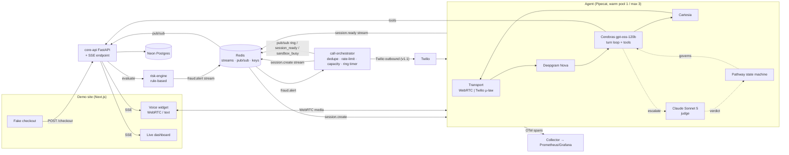
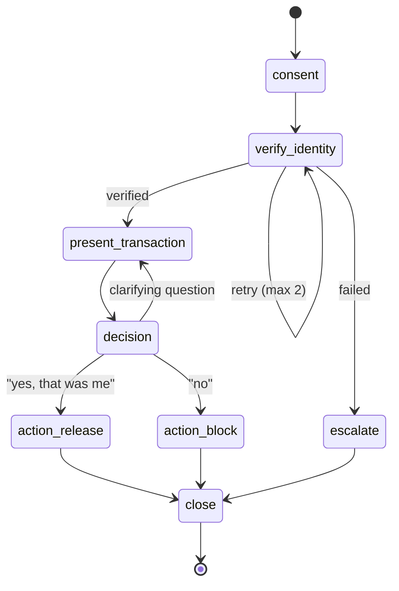

# BRIEF — Sentinel · Voice AI Fraud Detection

**One-liner:** An event-driven AI voice agent that calls a cardholder within seconds of a suspicious transaction, verifies their identity, and releases or blocks the card — replacing the "press 1 if this was you" IVR with a real conversation, built to showcase scaling, observability, and system design.

**Owner:** Yaksh · **Status:** Design (alert → browser handshake locked 2026-09-01) · **Target:** v1 in one weekend, v1.1 (phone "call me" mode) in week two.

---

## 1. Problem

Card issuers run outbound fraud-verification calls at massive scale. Today those are IVR trees ("press 1 to confirm, 2 to deny") with poor completion rates and no ability to handle follow-up questions. Voice-agent platforms like Bland replace the tree with an LLM-driven conversation, but the hard parts are not the AI — they are latency, idempotency, identity verification, PII handling, and staying up when 500 alerts fire at once.

This project imitates that slice of an enterprise fraud-ops system end to end, with a public sandbox anyone can try from a browser.

## 2. Goals

1. **Working demo**: a visitor triggers a fake transaction and is "called" by the agent within ~3 s, in the browser or on their phone.
2. **Systems showcase**: a documented, measured pipeline — alert-to-ring latency, per-stage turn latency (STT/LLM/TTS/network), p50/p95, behaviour under load, and where it breaks.
3. **Enterprise correctness**: idempotent alert handling, a state machine that cannot reach `action` without `verify_identity`, PII redaction in every log line, audit trail per tool call.
4. **Reusable foundation**: first project through the new bootstrap pipeline (template repo + `new-project` skill); a `v2` branch can later swap vendor STT/TTS for self-hosted models.

## 3. Non-goals (v1)

- Real telephony compliance (PCI-DSS, TCPA) — documented in `THREAT_MODEL.md`, not implemented.
- Multi-language, voice cloning, or custom speech models (that is v2).
- Real fraud detection — the risk engine is rule-based and fake.
- Handling inbound calls from customers.
- Auth/accounts for sandbox visitors.

## 4. Scenario

**Persona:** "Meridian Bank Fraud Prevention," calm, concise, never reads a full card number aloud.

**Happy path (deny):**
1. Visitor clicks *Pay $940 at "Lisboa Eletrónica"* on the fake checkout.
2. Risk engine flags it (foreign merchant + amount > threshold) and emits `fraud.alert`.
3. Orchestrator dedupes, checks rate limits and agent capacity, initiates a call (browser widget rings / phone rings).
4. Agent: consent line → "Am I speaking with Alex? Confirm the last four of your card and your city of birth."
5. Verification passes → "We saw $940 at an electronics store in Lisbon two minutes ago. Was that you?"
6. Caller: "No." → Agent calls `block_card_and_reissue`, confirms replacement card ships in 3–5 days, offers `escalate_to_analyst`, closes.
7. Dashboard shows: transaction **BLOCKED**, card **REISSUED**, audit rows, per-turn latency.

**Confirm path:** step 6 becomes `release_hold`; merchant checkout page flips to "Approved."

**Failure paths:** verification fails twice → polite close + `escalate_to_analyst`; no answer → SMS fallback (v1.1); caller goes off-script → agent answers briefly and returns to the current state; agent at capacity → visitor sees "sandbox busy" instead of a ring.

## 5. Architecture



### Services

| Service | Responsibility | Tech |
|---|---|---|
| `demo-web` | Fake checkout, voice widget (mic + text mode), live dashboard. Mints `visitor_id` on page load, opens SSE to `core-api`. No long-lived connections terminate here. | Next.js, Pipecat JS client |
| `risk-engine` | Evaluate transactions against rules, emit `fraud.alert` | FastAPI, Redis Streams producer |
| `call-orchestrator` | Consume alerts, dedupe by `alert_id`, per-customer rate limit, agent capacity check, mint `call_id`, publish `ring`, request agent session, own the ring timer, retry/backoff, SMS fallback | FastAPI worker, Redis |
| `agent` | Pipecat pipeline, persona, tools, state machine. Warm pool (1) + concurrency cap (3), publishes `agent:capacity`. | Pipecat, Deepgram, Cartesia, Cerebras `gpt-oss-120b`, Claude Sonnet 5 (judge) |
| `core-api` | Customers, cards, transactions, holds, audit log, session caps. **Also:** SSE endpoint per visitor, connection registry, pub/sub subscriber that fans events to the right SSE stream. | FastAPI, Neon Postgres, Redis |
| `observability` | Traces, metrics, dashboards | OpenTelemetry, Prometheus, Grafana (or a simple in-app dashboard) |

### Alert → browser session handshake (decided)

**Design choices and why**

| Decision | Choice | Rejected alternatives |
|---|---|---|
| How the browser learns it's being called | Persistent SSE from page load; orchestrator pushes `ring` | Polling (adds up to one interval to alert-to-ring, pollutes p95); blocking checkout POST (collapses the event-driven pipeline into an RPC, can't ring later or extend to phone) |
| Signaling vs media | SSE for server→browser signaling, separate WebRTC connection for media | Single WebSocket for both (an SSE reconnect would drop the call) |
| Binding visitor to customer | Anonymous `visitor_id` minted on page load (cookie), attached to the fake txn as `customer_id` | Shared demo customer routed by socket; persona picker |
| When the agent pipeline starts | Ring UI shown immediately; pipeline pre-warmed in parallel during the ring | Auto-answer; wait for answer then cold start |
| Orchestrator → agent session request | Redis stream out (`session.create`), Redis stream back (`session.ready`), never blocks | HTTP request/response (orchestrator idles for pre-warm; 50 alerts = 50 blocked waits) |
| Connection registry (`visitor_id` → SSE connection) | Redis from day one | In-process dict (breaks the moment `core-api` has two instances) |
| Where SSE terminates | `core-api` | Next.js route handlers (Vercel execution-time limits make long-lived SSE awkward) |
| Agent capacity | Warm pool = 1, max concurrent sessions = 3 | 1/1 (a second visitor is bounced); unbounded (sandbox cost) |

**Sequence**

1. Page load → `demo-web` mints `visitor_id` (cookie) → opens `GET core-api/events?visitor_id=…` (SSE). `core-api` writes `conn:{visitor_id}` in Redis with a TTL refreshed by SSE heartbeats, and creates/reuses the `sandbox_sessions` row.
2. Click *Pay $940* → `POST core-api/checkout {visitor_id, amount, merchant}` → `core-api` writes a `held` transaction and calls `risk-engine`.
3. `risk-engine` → `XADD fraud.alert`.
4. Orchestrator `XREADGROUP fraud.alert` → `SET NX alert:{id}` (dedupe) → rate-limit check → `DECR agent:capacity`; if the result is negative, `INCR` it back and publish `sandbox_busy` instead of `ring`. Otherwise mint `call_id`, insert the `calls` row through `core-api` (`state = ringing`), start a 30 s ring timer, and **in parallel**:
   - `PUBLISH ring` on the visitor's channel → `core-api` forwards over SSE → widget rings. `alert_to_ring_ms` is stamped here.
   - `XADD session.create` → agent picks it up, hands out a warm pipeline (or cold-starts one up to the cap), keeps it silent.
5. Agent `XADD session.ready {call_id, session_url, token, expires_at}` → orchestrator `PUBLISH session_ready` → SSE → widget now has a WebRTC endpoint. `calls.state = ready`.
6. Visitor clicks *Answer* → browser connects WebRTC with the single-use `token` → agent validates it against `call_id` → transport connected → state machine enters `consent`, first TTS fires. `calls.state = connected → in_call`. The agent owns `calls.state` from here.
7. Call ends (any outcome) → agent `INCR agent:capacity`, tears down the pipeline, refills the warm pool to 1.

**Redis roles** (keep them separate in your head and in the code)

- Streams (`fraud.alert`, `session.create`, `session.ready`): durable consumer-group work queues; unacked entries are redelivered after a crash.
- Pub/sub (`ring`, `session_ready`, `sandbox_busy`, `session.cancel`): fire-and-forget fan-out to whichever `core-api` instance holds the visitor's SSE. No subscriber = dropped, which is correct for a ring.
- Keys: `alert:{id}` (dedupe, `SET NX`), `conn:{visitor_id}` (registry, TTL), `agent:capacity` (integer counter), `events:{visitor_id}` (short list, TTL 60 s, replayed via SSE `Last-Event-ID` after a reconnect).

**Event contracts**

```
fraud.alert      {alert_id, txn_id, customer_id, risk_reasons[], emitted_at}
session.create   {call_id, alert_id, customer_id, channel: "browser", created_at}
session.ready    {call_id, session_url, token, expires_at}
session.cancel   {call_id, reason}
ring             {call_id, alert_id, ring_timeout_s: 30}          (pub/sub)
session_ready    {call_id, session_url, token}                     (pub/sub)
sandbox_busy     {alert_id, retry_after_s}                         (pub/sub)
```

`call_id` is minted by the orchestrator before anything is published and is the join key across the `calls` row, both streams, pub/sub payloads, the WebRTC token, and the OTel trace. `token` is single-use, bound to `call_id`, expires with the ring timeout; the agent rejects anything else (closes the "join someone else's call" path).

**Failure edges**

- Visitor declines, or 30 s passes without a WebRTC connect → orchestrator marks `no_answer`, publishes `session.cancel` so the agent releases the pre-warmed pipeline, flags the alert for SMS fallback (v1.1).
- `session.ready` never arrives (agent saturated or crashed) → same ring timer; visitor sees "connecting…" then a graceful "we'll try again". Expected to be the first thing to break in the load test.
- SSE reconnect mid-ring → `Last-Event-ID` replays missed `ring`/`session_ready` from `events:{visitor_id}`.
- Capacity race → `DECR`-and-check is atomic in Redis; a failed check is undone with `INCR`.
- Judge unavailable or slow (Anthropic timeout/429) → **fail closed**: the rejected transition stays rejected, the turn falls back to `escalate_to_analyst`. An unreachable judge must never soften into an approval.

### Model stack (decided)

Two tiers, split by what each is good at. The turn loop is latency-bound; the judge is correctness-bound and fires only on the decisions that are expensive to get wrong.

| Role | Model | When it runs | Why |
|---|---|---|---|
| Turn loop — reply + `proposed_state` + `tool_call?` | **Cerebras `gpt-oss-120b`** | Every caller turn, in-band | Cerebras inference is the cheapest way to keep `llm_ms` inside the < 1.2 s p50 voice-to-voice budget; a 120B open-weights model is comfortably above the bar for a six-state script with five tools |
| Judge / verifier | **Claude Sonnet 5** (`claude-sonnet-5`) | Only on escalation | Stronger tool and instruction discipline where a wrong call is irreversible or the fast model already broke a rule |

**Escalation triggers** (v1 starting policy — calibrated in PLAN 2.4):

1. The validator **rejects** the fast model's `proposed_state`. Rather than re-prompting the model that just broke the rule, hand the judge the transcript, current state, and the violated rule.
2. A proposed transition into `action_release` or `action_block` — the two irreversible outcomes.

Everything else stays single-model. The judge returns the **same** structured `{reply_text, proposed_state, tool_call?}` schema, so the validator is indifferent to which model produced it — and, critically, **the judge is re-validated, not trusted**: it can propose a transition, never authorise one. At most one escalation per turn; a second rejection goes to `escalate_to_analyst`.

**Cost and latency.** Sonnet 5 is $2 / $10 per MTok in/out, so an escalation is negligible in dollars; latency is the real cost, which is why the triggers are narrow. Whether the agent needs a holding line ("one moment while I confirm that") to cover judge round-trip is open until 2.4 measures it.

### Pathway state machine



Rules enforced in code, not in the prompt:
- `action_*` and `escalate` are unreachable unless `verify_identity` succeeded.
- Every transition is logged with `call_id`, `from`, `to`, `trigger`, `latency_ms`.
- The LLM proposes the next state via a structured output; the state machine accepts or rejects.
- The Sonnet judge is bound by the same validator — an escalation is a second opinion, never a bypass.

### Tools (each writes an audit row)

| Tool | Guard | Effect |
|---|---|---|
| `lookup_transaction(alert_id)` | state ≥ `present_transaction` | returns merchant, amount, city, time |
| `verify_challenge(last4, answer)` | state = `verify_identity` | returns pass/fail, increments attempts |
| `release_hold(txn_id)` | verified ∧ state = `action_release` | hold → released |
| `block_card_and_reissue(card_id)` | verified ∧ state = `action_block` | card → blocked, reissue order created |
| `escalate_to_analyst(call_id, reason)` | any | creates analyst ticket, ends call |

### Data model (Neon)

`customers` (in the sandbox, one row per `visitor_id`) · `cards` (last4, status) · `transactions` (status: pending/held/released/blocked) · `fraud_alerts` (alert_id PK, txn_id, status, attempts) · `calls` (call_id, alert_id, channel, **state**: ringing/ready/connected/in_call/completed/no_answer/dropped/busy, state history JSONB, outcome, ring_at, ready_at, connected_at) · `turns` (call_id, idx, role, text_redacted, stt_ms, llm_ms, tts_ms, net_ms) · `audit_log` (call_id, tool, args_redacted, result, ts) · `sandbox_sessions` (visitor_id, ip_hash, minutes_used, day).

### Idempotency & reliability
- `fraud.alert` carries `alert_id`; orchestrator uses `SET NX` on `alert:{id}` before dialing.
- Rate limit: 1 call per customer per 10 min; 1 phone call per verified number per day.
- Capacity: `agent:capacity` counter in Redis (agent decrements on session start, increments on end); orchestrator `DECR`-checks before ringing.
- Retry: 3 attempts with exponential backoff on transport failure; no-answer → SMS (v1.1).
- Agent crash mid-call → call row marked `dropped`, alert requeued once; unacked `session.create` entries are redelivered by the consumer group.

### Security & compliance
- Never speak or log full PAN; regex + Luhn redaction on every transcript and log line before persistence.
- Consent line at call start; recording toggle off by default in the sandbox.
- Single-use, `call_id`-bound WebRTC token with ring-timeout expiry.
- "Call me" requires SMS OTP verification of the number, US numbers only, Turnstile before submit.
- `docs/THREAT_MODEL.md`: attacker-triggered callbacks, social-engineering the agent into `release_hold`, prompt injection via the caller's speech, cost-exhaustion of the sandbox, joining another visitor's session.

## 6. Demo site

| Mode | How | Cost |
|---|---|---|
| Browser sandbox | Mic via WebRTC (SmallWebRTC), or **Type instead** | ~$0.07/min voice, ~free text |
| Call me (v1.1) | Enter number → OTP → real Twilio outbound call | ~$0.09/min |
| Watch | Recorded call + dashboard replay | free |

Guardrails: 3-min session cap, daily minute cap with "sandbox at capacity" state, IP rate limit, max 3 concurrent agent sessions ("sandbox busy" beyond that), unlimited text mode, launch-week budget ≈ $70–100.

## 7. Observability (the showcase)

**Traces:** one trace per call (trace ID = `call_id`); spans per turn: `stt`, `llm`, `tool.<name>`, `tts`, `network`; plus handshake spans `ring`, `session.create → session.ready`, `webrtc.connect`.
**Metrics:**
- `alert_to_ring_ms` (SLA target < 3000 ms) — stamped at `ring` publish, excludes pre-warm
- `session_ready_ms` (alert → `session.ready`), `answer_to_first_tts_ms`
- turn latency p50/p95 per stage; end-to-end voice-to-voice target < 1200 ms p50
- `judge_invocations_total` by trigger (rejection vs irreversible action), `judge_ms` p50/p95, share of turns escalated, judge-verdict distribution (upheld/corrected/failed closed)
- verification success rate, decision distribution (confirm/deny/escalate/dropped/no_answer/busy)
- `agent_sessions_active`, `agent_sessions_rejected`, `session_create_stream_lag` (backpressure signal), warm-pool hit rate
- calls dropped mid-flow, retries, dedupe hits, rate-limit rejections, SSE reconnects
- sandbox minutes used vs cap
**Dashboard:** Grafana (or in-app) panel shown beside the widget during a call.
**Load test:** script spawning 10 → 20 → 50 simulated WebSocket callers with scripted audio; record where latency degrades, what breaks, and why → `docs/SCALING.md` with the fix plan (worker pool sizing, queue backpressure, per-stage caching). Expected first breaking point: `session.create` lag once `agent:capacity` hits zero.

## 8. Milestones

| When | Deliverable | Done when |
|---|---|---|
| Sat AM | Transport skeleton | Browser mic → FastAPI WebSocket echo, per-frame timing logged |
| Sat PM | First conversation | Pipecat + Deepgram + `gpt-oss-120b` + Cartesia; persona; 3 tools hit Neon; full happy path in browser |
| Sun AM | State machine + risk pipeline | Pathway enforced in code; risk-engine → Redis → orchestrator → `session.create`/`session.ready` → SSE `ring`/`session_ready` → WebRTC; dedupe and capacity check work |
| Sun PM | Demo page + observability | Fake checkout triggers a ring; dashboard shows outcome + per-turn latency; OTel spans; `/health`, `/metrics` |
| Week 2 | Call-me mode + load test + write-up | Twilio outbound with OTP; 10–50 concurrent simulated calls; `SCALING.md`, `THREAT_MODEL.md`, LinkedIn post + video |
| Later (v2) | Self-hosted speech | Whisper/Parakeet STT, Kokoro TTS, WER + latency benchmarks vs vendors |

## 9. Success metrics

- Alert-to-ring < 3 s p95 in the browser.
- Voice-to-voice turn latency < 1.2 s p50, < 2 s p95.
- Zero `action_*` transitions without prior verification in the audit log (tested).
- Zero unredacted PAN-like strings in logs/transcripts (tested with seeded fakes).
- Zero WebRTC connects accepted without a valid `call_id`-bound token (tested).
- Load test report published with a concrete breaking point and mitigation plan.
- Sandbox survives launch week within budget.

## 10. Open questions

**Resolved**
- ~~Redis Streams vs Kafka?~~ → Redis Streams, producer/consumer behind an interface so Kafka is a swap.
- ~~Orchestrator → agent request style?~~ → Redis streams both ways, non-blocking.
- ~~Connection registry location?~~ → Redis from day one.
- ~~Where SSE terminates?~~ → `core-api`.
- ~~Agent concurrency?~~ → warm pool 1, max 3.
- ~~LLM choice?~~ → two tiers: Cerebras `gpt-oss-120b` for the turn loop, Claude Sonnet 5 as escalation judge. See "Model stack".
- ~~Postgres host?~~ → Neon (project linked 2026-09-01, branch `production`); branching replaces a local Postgres container.
- ~~Who writes the `calls` row — the orchestrator directly, or through `core-api`?~~ → through `core-api` (2026-09-01). One writer for the table means `state_history` appends and transition legality have one implementation, shared with the agent; the cost is one internal hop inside the `alert_to_ring_ms` budget.
- ~~Text mode: does it reuse the same `session.create` path with a text transport, or bypass WebRTC entirely?~~ → **reuse — and more of it than the question assumed** (2026-09-02). PLAN 1.4 found no second transport is needed at all: `PipelineWorker` prepends an `RTVIProcessor` above the pipeline, so a typed message arrives as an `RTVIClientMessageFrame` travelling the same path the audio does and the reply leaves as an `RTVIServerMessageFrame`. Text is therefore not a parallel mode but the same call with a different input frame — one `session.create`, one `call_id`, one pipeline, one set of `turns` and `audit_log` rows, one trace. That is the deciding argument: the authority model (state machine, tool guards, judge escalation) is what this system *is*, and a bypass would mean building it twice and keeping the two honest. Verified without a microphone — a peer connection carrying only a data channel completes the RTVI handshake and echoes typed text — so a visitor who declines the mic genuinely does not need one. Two costs accepted. Text still requires WebRTC, which a corporate firewall may block where a WebSocket would pass; if that bites, `FastAPIWebsocketTransport` feeds the same pipeline, making it a transport swap rather than a redesign. And a text call consumes agent capacity exactly like a voice call, which is correct: the scarce resource is the pipeline, not the microphone.
- ~~Agent internals: where the state machine object lives inside the Pipecat pipeline, and the exact structured-output schema?~~ → **between the LLM and the TTS, reading a shared `ProposedTurn`** (2026-09-03, [STATE_MACHINE.md](STATE_MACHINE.md)). The position is the design: it is the last point at which nothing has reached the caller's ears and no tool has run. PLAN 2.5 supplied the argument — the agent invented a $39 charge at a merchant that does not exist and read it to the cardholder *before* calling `lookup_transaction`, with a system prompt that forbade exactly that in as many words. A validator sitting downstream of the TTS would have audited a sentence already spoken. The schema is `sentinel_contracts.pathway.ProposedTurn` — `{reply_text, proposed_state, tool_call?}`, every field a proposal, nothing spoken or run until the transition is accepted — and it is the same schema for the fast model and the judge, so the validator cannot tell them apart. The transition table, the verified-only actions, and the tool-to-state binding live beside it as data rather than prose.
- ~~Judge trigger policy, thresholds, and whether a holding line is needed?~~ → **both triggers kept; holding line required** (2026-09-03, [LLM_CHOICE.md](LLM_CHOICE.md)). Measured: a Claude Sonnet 5 escalation costs **1.8 s p50, 4.87 s p95**, against a fast turn of 257 ms. An escalated turn lands near 2.8 s voice-to-voice — 2.3× the < 1200 ms p50 budget — so the agent says *"One moment while I confirm that."* when an escalation starts. That line is a constant in config, not model output: the model that just produced a rejected turn is not the thing to ask for a stalling phrase. `JUDGE_TIMEOUT_S` went 4.0 → 6.0 because the guessed ceiling sat below the measured p95 and would have failed closed on ~1 escalation in 20 out of impatience alone. Both triggers stay: 16 of 16 verdicts were legal transitions, and on 2.5's fabricated-transaction turn the judge returned `verify_identity` + `verify_challenge` + *"Thank you, let me verify that information now."* — staying where the pathway was, reaching for the skipped tool, inventing nothing.

**Still open**
- Grafana stack vs in-app dashboard for v1? → In-app for the demo page, Grafana for the write-up screenshots.
- Where to host services: Fly.io / Railway, Vercel for `demo-web` — not yet committed. (Postgres is settled: Neon.)
- SSE heartbeat interval and `conn:{visitor_id}` TTL (leaning 15 s / 45 s).
